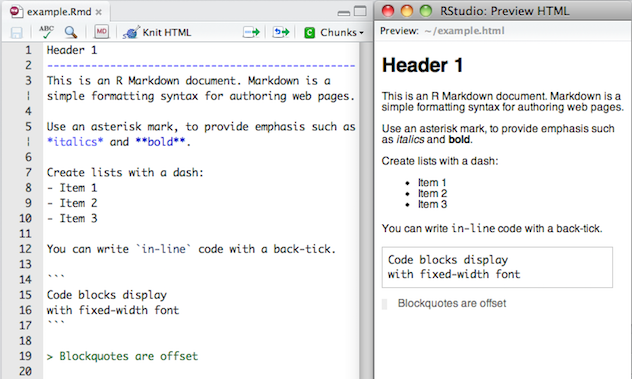
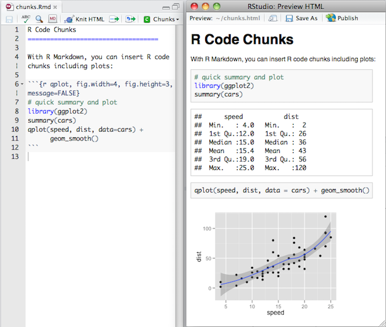

```{r setup, echo=FALSE}
knitr::opts_chunk$set(echo = TRUE)
```

## Outline

- Introduction to R and RStudio
- Reproducible data analysis with R Markdown
- Data visualization
- Data wrangling
- What next?
- Hands on exercises

# Introduction to R and RStudio

## What is R and RStudio

- **R:** Statistical programming language

- **RStudio:** 
    - Inregtrated development environment for R
    - Powerful and productive user interface for R

- Both are free and open-source

## Getting started

- Traditionally you would install R and RStudio on your computer

- We will skip over that step for now for efficiency and use the RStudio server at

https://vm-manage.oit.duke.edu/containers

(Log in with your Duke Net ID and password)

- Local installation instructions will be provided at the end of the workshop

## Anatomy of RStudio

<div class="columns-2">
- Left: Console
    - Text on top at launch: version of R that you’re running
    - Below that is the prompt
- Upper right: Workspace and command history
- Lower right: Plots, access to files, help, packages, data viewer


</div>

## What version am I using?

- The version of R is text that pops up in the Console when you start RStudio

- To find out the version of RStudio go to Help $\rightarrow$ About RStudio

- It's good practice to keep both R and RStudio up to date

## R packages {.smaller}

- Packages are the fundamental units of reproducible R code. They include reusable R
functions, the documentation that describes how to use them, and (often) sample data.
(From: http://r-pkgs.had.co.nz)

- We will use the `ggplot2` package for plots and `dplyr` for data wrangling in this
workshop

- Install these packages by running the following in the Console:
```{r install-packages, eval=FALSE}
install.packages("ggplot2")
install.packages("dplyr")
```

- Then, load the packages by running the following:
```{r load-packages, message=FALSE}
library(ggplot2)
library(dplyr)
```
    
- This is just one way of installing a package, there is also a GUI approach in 
the Packages pane in RStudio

# Reproducible data analysis with R Markdown

## What is R Markdown?

- R Markdown is an authoring format that enables easy creation of dynamic documents, 
presentations, and reports from R. 

- It combines the core syntax of markdown (an easy-to-write plain text format) with 
embedded R code chunks that are run so their output can be included in the final document.

- R Markdown documents are fully **reproducible** (they can be automatically regenerated 
whenever underlying R code or data changes).

Source: http://rmarkdown.rstudio.com/

## Your turn!

Create your first R Markdown document, knit it, and examine the source code 
and the output.

1. File $\rightarrow$ R Markdown...

2. Enter a title (e.g. "My first R Markdown document") and author info

3. Choose Document as file type, and HTML as the output

4. Hit OK

5. Click Knit HTML in the new document, which will prompt you to save your document
    - Naming tip: Do not use spaces
    - Viewing tip: Click on the down arrow next to Knit HTML and select View in Pane
    
## Markdown basics {.smaller}

- Markdown is a simple formatting language designed to make authoring content easy for 
everyone. 

- Rather than writing complex markup code (e.g. HTML or LaTeX), Markdown enables the use 
of a syntax much more like plain-text email. 



## R Code Chunks {.smaller}

Within an R Markdown file, R Code Chunks can be embedded using the native Markdown syntax 
for fenced code regions.



## Your turn!

How many code chunks are in your R Markdown document?

What does each code chunk do? You may not understand the R syntax yet,
but you should be able to compare the source file and the output to answer
this question.

## Inline R Code

You can also evaluate R expressions inline by enclosing the expression within a single 
back-tick qualified with ‘r’. For example, the following code:


Results in this output: "I counted `r 1 + 1` red trucks on the highway."

## Your turn!

Suppose Sammy works on average 8.37 hours per day, 5 days
per week. How many hours do they work on average per week?

Add a sentence to your document that includes simple inline R code that answers
this question, along the lines of...

"Sammy works 8.37 * 5 hours per week, on average."

## Workspaces

R Markdown workspace and Console workspace are independent of each other

- If you define a variable in your Console and it shows up in the Environment
tab, it is not going to be automatically included in your R Markdown document

- If you define a variable in your R Markdown document, it won't automatically
be available in your Console
    
[ Demo ]

**Tip:** Use the *Run all previous chunks* in the source file and *Run current chunk code*
functionality in the buttons in each code chunk to help manage workspaces.

## Workspaces and reproducibilty

- The fact that the two workspaces do not automatically have access to the same variables
might / will be frustrating at first.

- But this is not a bug, in fact, it's a functionality that helps reproducibility, as it
ensures that all variables, functions, etc. that are being used in the R Markdown 
document are explicitly defined or loaded.

## Your turn!

1. Define `x = 2` in the Console. Then, in your Console run `x * 3`. Does your code 
run as expected?

2. Now, insert a new code chunk in your R Markdown document and in this chunk type
`x * 3` only. Knit your document. Does the document compile, or do you get an error?
If you get an error, how can you fix this? Implement the fix and Knit your document.
Make sure you are able to compile without errors before you move on.


3. Next insert another code chunk in your


